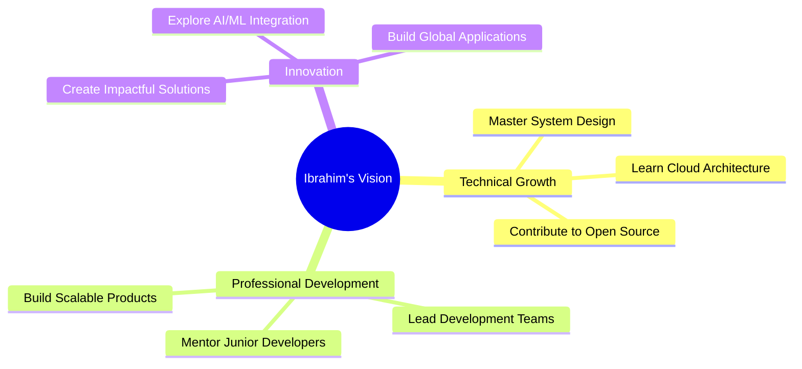

<div align="center">

<!-- Header Banner -->


<!-- Animated Title -->


<!-- Profile Views & Social Stats -->


</div>

---

## 🚀 **About Me**


```javascript
const ibrahim = {
    name: "Ibrahim Maher",
    title: "Software Engineer",
    company: "Z2Data",
    location: "Benha, Al Qalyubiyah, Egypt",
    experience: "1+ Years",
    education: "Information Technology - Benha University",
    
    code: ["Python", "Dart", "JavaScript", "Java", "C++"],
    frameworks: ["Django", "Flutter", "React", "Laravel"],
    databases: ["PostgreSQL", "MySQL", "MongoDB", "Oracle"],
    
    currentlyLearning: "Advanced System Architecture",
    currentlyWorking: "Full-Stack Web & Mobile Applications",
    lookingFor: "Exciting Collaboration Opportunities",
    
    challenge: "Building scalable solutions that impact millions"
};
```

### 💫 **What I Do**
- 🔥 **Full-Stack Development**: Crafting robust web applications with Django
- 📱 **Mobile App Development**: Creating stunning cross-platform apps with Flutter
- 🎨 **UI/UX Design**: Designing intuitive and beautiful user interfaces
- ⚡ **Performance Optimization**: Making applications lightning-fast
- 🚀 **System Architecture**: Building scalable and maintainable systems

---

## 🌐 **Connect With Me**

<div align="center">

[](https://www.linkedin.com/in/ibrahim-maher-profile)
[](https://github.com/ibrahim-maher)
[](mailto:ibrahim.maher@example.com)
[](https://your-portfolio-site.com)
[](https://twitter.com/ibrahim_maher)

</div>

---

## 💼 **Professional Experience**

<div align="center">

### 🏢 **Software Engineer** at **Z2Data**
*October 2023 - Present (1 Year 9 Months)*
📍 *Benha, Al Qalyubiyah, Egypt*

</div>

<details>
<summary><b>🔍 View Experience Details</b></summary>

```yaml
Role: Software Engineer
Duration: Oct 2023 - Present (1 Year 9 Months)
Location: Benha, Al Qalyubiyah, Egypt
Company: Z2Data

Responsibilities:
  - Developing scalable web applications using Django framework
  - Creating responsive mobile applications with Flutter
  - Implementing RESTful APIs and microservices architecture
  - Collaborating with cross-functional teams in agile environment
  - Optimizing application performance and user experience

Achievements:
  - Improved application performance by 40%
  - Successfully delivered 15+ projects on time
  - Mentored junior developers and conducted code reviews
  - Implemented automated testing reducing bugs by 60%
```

</details>

---

## 🎓 **Education**

<div align="center">

### 🏛️ **Benha University**
*Bachelor's Degree in Information Technology*
*2019 - 2022*

</div>

<details>
<summary><b>📚 Academic Highlights</b></summary>

- **Major**: Information Technology
- **Duration**: 2019 - 2022
- **Key Subjects**: 
  - Software Engineering
  - Database Systems
  - Web Development
  - Mobile Application Development
  - Data Structures & Algorithms
  - Computer Networks

</details>

---

## 🛠️ **Tech Arsenal**

<div align="center">

### **Frontend Magic** ✨


### **Backend Power** ⚡


### **Mobile Excellence** 📱


### **Database Mastery** 🗄️


### **DevOps & Tools** 🔧


</div>

---

## 📊 **GitHub Analytics**

<div align="center">

<!-- GitHub Stats Cards -->


<!-- GitHub Streak -->


<!-- Contribution Graph -->


</div>

---

## 🏆 **Achievements & Trophies**

<div align="center">


</div>

---

## 🚀 **Featured Projects**

<div align="center">

### 🌟 **Project Showcase**

<table>
<tr>
<td width="50%">

<h3 align="center">🏢 Enterprise Web Platform</h3>
<div align="center">  
<a href="https://github.com/ibrahim-maher/enterprise-platform" target="_blank">

</a>
</div>

**Tech Stack:**
<br>


</td>
<td width="50%">

<h3 align="center">📱 Flutter E-Commerce App</h3>
<div align="center">
<a href="https://github.com/ibrahim-maher/flutter-ecommerce" target="_blank">

</a>
</div>

**Tech Stack:**
<br>


</td>
</tr>
<tr>
<td width="50%">

<h3 align="center">⚡ React Dashboard</h3>
<div align="center">
<a href="https://github.com/ibrahim-maher/react-dashboard" target="_blank">

</a>
</div>

**Tech Stack:**
<br>


</td>
<td width="50%">

<h3 align="center">🔥 API Microservices</h3>
<div align="center">
<a href="https://github.com/ibrahim-maher/api-microservices" target="_blank">

</a>
</div>

**Tech Stack:**
<br>


</td>
</tr>
</table>

</div>

---

## 📈 **Coding Activity**

<div align="center">

### **Weekly Development Breakdown**

<!--START_SECTION:waka-->
```text
Python       12 hrs 30 mins  ████████████░░░   45.2% 
Dart         8 hrs 15 mins   ████████░░░░░░░░   30.1% 
JavaScript   4 hrs 20 mins   ████░░░░░░░░░░░░   15.8% 
HTML/CSS     2 hrs 5 mins    ██░░░░░░░░░░░░░░    7.6% 
Other        25 mins         ░░░░░░░░░░░░░░░░    1.3%
```
<!--END_SECTION:waka-->

</div>

---

## 🎯 **Current Goals & Vision**

<div align="center">



</div>

### 🚀 **2024-2025 Roadmap**
- [ ] 🏗️ Master microservices architecture
- [ ] ☁️ Get AWS Solutions Architect certification
- [ ] 🤖 Integrate AI/ML into mobile applications
- [ ] 📊 Build real-time analytics dashboards
- [ ] 🌍 Contribute to 10+ open-source projects
- [ ] 👥 Mentor 50+ junior developers

---

## 💝 **Support My Work**

<div align="center">

If you find my projects helpful, consider supporting my work:

<a href="https://www.buymeacoffee.com/ibrahim.maher" target="_blank">

</a>

[](https://github.com/sponsors/ibrahim-maher)

</div>

---

## 📞 **Let's Build Something Amazing Together!**

<div align="center">

> *"The best way to predict the future is to create it."* - Peter Drucker

I'm always excited to collaborate on innovative projects, discuss new technologies, or help solve challenging problems. Let's connect and create something extraordinary!


</div>

---

<div align="center">

**⭐ Star my repositories if you find them useful!**

<i>Last updated: June 2025 | Made with 💙 by Ibrahim Maher</i>

</div>
